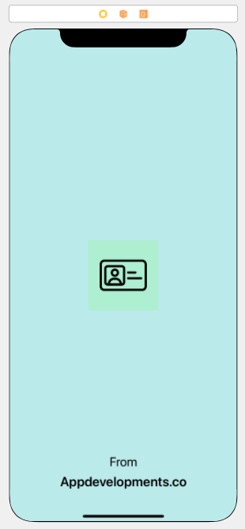

# Lesson 1.5 My Name Card
## Topic 1: Get Started! Your First iOS App

## Our Goal

The objective of this tutorial is to create an launch screen.

## What you will create

We’re going to make a launch screen into your Name Card app which you will place your photo of yourselves, your name, and job title.

## Your Challenge
* Your challenge is to duplicate the design below into LaunchScreen.storyboard

## What you will learn in Topic 1

* How to create add image into your application.
* Understand x1, x2 and x3 of image.
* Design and add an App Icon.
* Running the App on your iPhone.
* Create a launch screen

## Donation and Support

If you like our courses, please [subscribe](https://www.youtube.com/channel/UCd-LoFICt8Eo5c6KIjyvbPA?sub_confirmation=1) to our YouTube channel and if you are able affort, buy us a coffee or a meal via
* [PayPal](https://www.paypal.com/paypalme/wescsk)
* [patreon](https://www.patreon.com/appdevelopments)

>This is a project of The Appdevelopments.co's Complete iOS tutorial for beginner, check out the full course or other courses at [appdevelopments.co](https://appdevelopments.co/course/fullios/resource&video)
